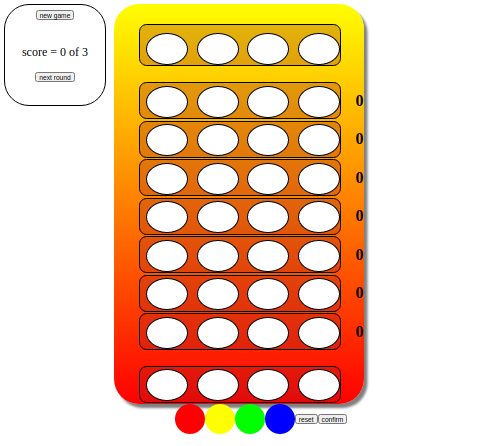

# MasterMind

> Created a simple MasterMind using Javascript

| 

## Built With

- Javascript

## Live Demo

[Live Demo Link](https://garciajordy.github.io/NewsWeek-Project/)

## Instructions
To get a local copy up and running follow these simple example steps.

### Setup
- Clone in the terminal or download this entire [GitHub Repo](https://github.com/garciajordy/Mastermind) and go to the index.html file.

### Install
- Set up liveserver as an extension in your VS Code.
- If you dont have the live server extension, or are using another software just view directly in your browser.

### Usage
- Right click and open the index.html in your browser to view.

## Author

👤 **Jordy Garcia**

- GitHub: [@githubhandle](https://github.com/garciajordy)
- LinkedIn: [LinkedIn](https://www.linkedin.com/in/jordy-garcia-675849206/)

## 🤝 Contributing

Contributions, issues, and feature requests are welcome!

Feel free to check the [issues page](issues/).

## Show your support

Give a ⭐ if you like this project!

## Acknowledgments

- Inspiration

## 📝 License

This project is [MIT](./LICENSE) licensed.
